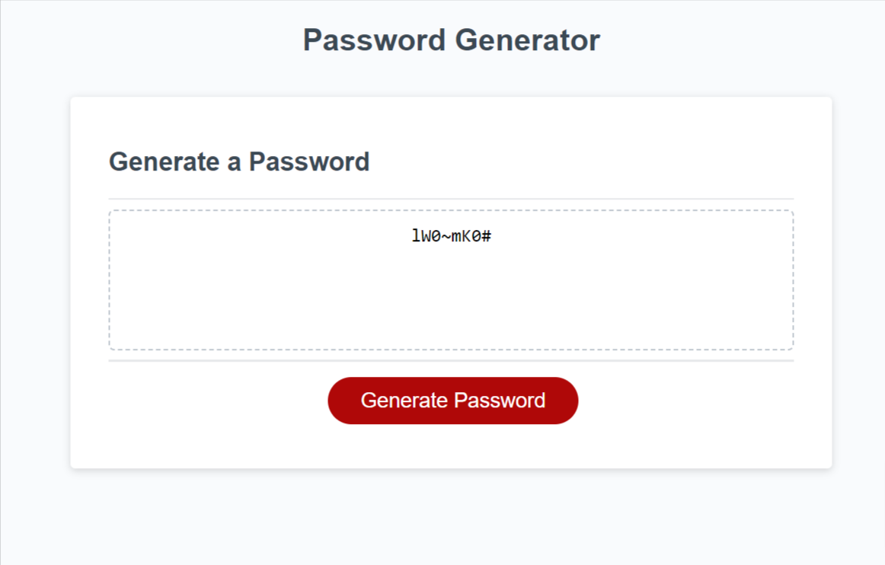

# Password-Generator

## Description

The password generator is a program that provides the user with a new and secure password that is randomly generated based on criteria selected by the user. The random generation of a password with variable length provides the user with the benefit of a strong and secure password that can protect their sensitive data.

[Password Generator](https://codehashira28.github.io/Password-Generator/)

## Installation

N/A

## Usage

The password generator opens up with a simple user interface that has a dashed border textbox and a "generate password" button. When the user clicks the "generate password" button, they are prompted with a series of questions and instructions that will specify the criteria for their password. Edge case error checking has been put in place if the user enters invalid data or no criteria is selected for their password. Once the user has specified the desired criteria, the program will generate a random password that meets the criteria and display it in the dashed border textbox.

## Credits

N/A